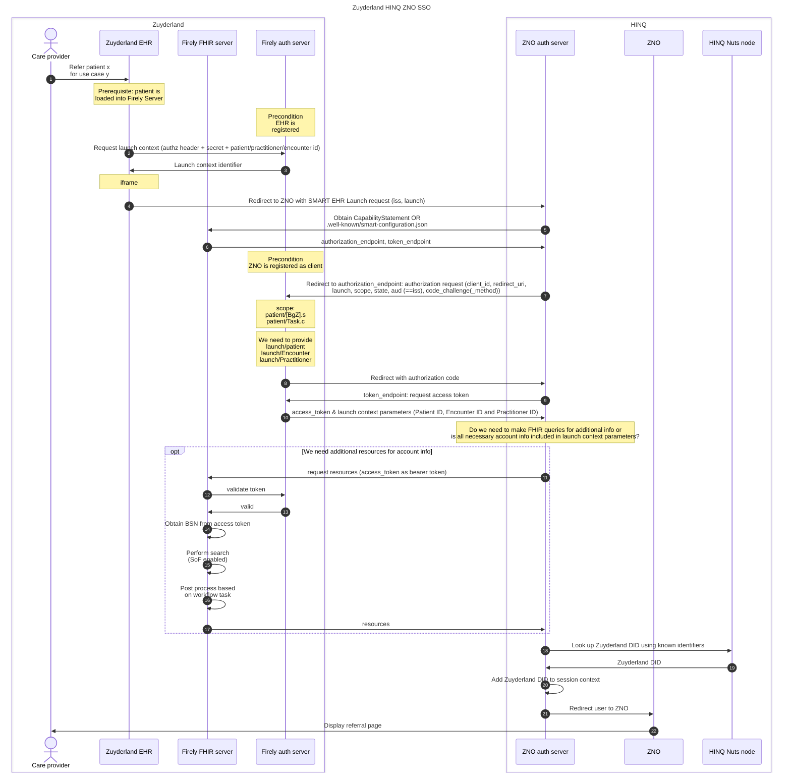
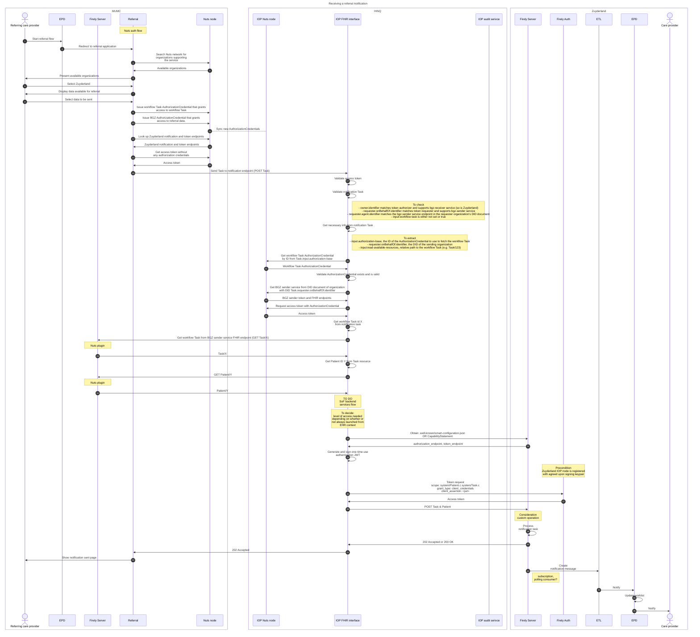
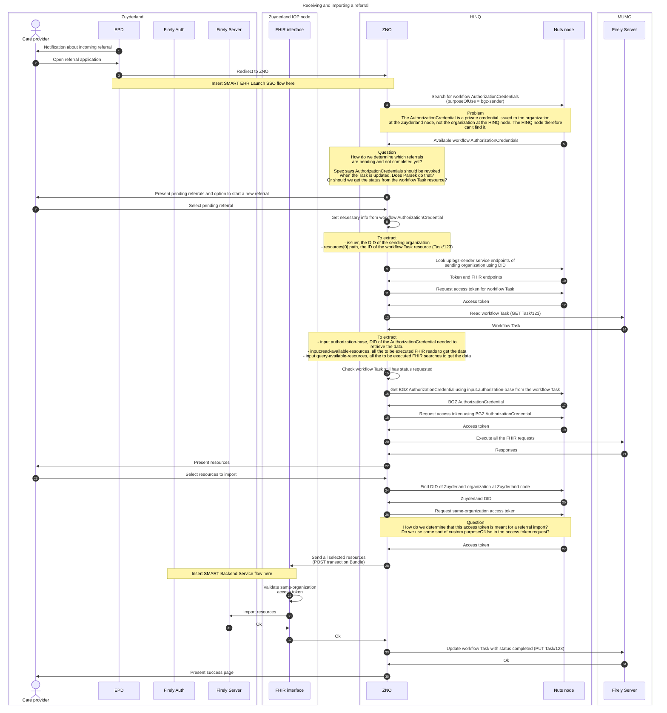

# UML diagrams for Zuyderland-MUMC-VieCuri referrals

UML diagrams for the VIPP5 referral project with Zuyderland, MUMC and VieCuri. These sequence diagrams are from the perspective of Zuyderland.

## SMART-on-FHIR based Zuyderland-HINQ SSO

## Incoming referral notification

## Accepting and importing an incoming referral

