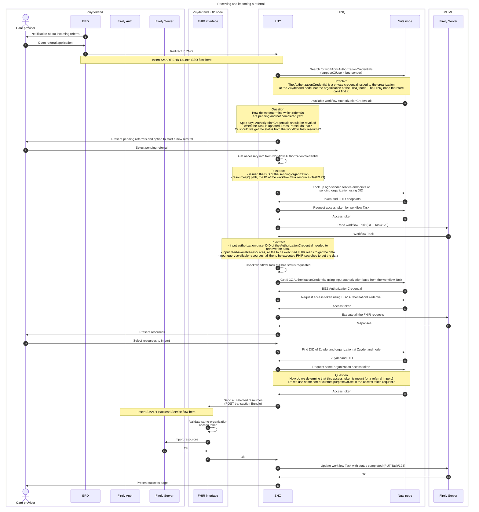

# Accepting and importing an incoming referral

```mermaid
sequenceDiagram
    autonumber

    title Receiving and importing a referral

    box Zuyderland
        actor zp as Care provider
        participant ze as EPD
        participant za as Firely Auth
        participant zf as Firely Server
    end

    box Zuyderland IOP node
        participant zif as FHIR interface
    end

    box HINQ
        participant hz as ZNO
        participant hn as Nuts node
    end

    box MUMC
        participant mf as Firely Server
    end


    ze->>zp: Notification about incoming referral
    zp->>ze: Open referral application
    ze->>hz: Redirect to ZNO
    note over ze,hz: Insert SMART EHR Launch SSO flow here
    hz->>hn: Search for workflow AuthorizationCredentials<br/>(purposeOfUse = bgz-sender)
    note over hz,hn: Problem<br/>The AuthorizationCredential is a private credential issued to the organization<br/>at the Zuyderland node, not the organization at the HINQ node. The HINQ node therefore<br/>can't find it.
    hn->>hz: Available workflow AuthorizationCredentials
    note over hz: Question<br/>How do we determine which referrals<br/>are pending and not completed yet?<br/><br/>Spec says AuthorizationCredentials should be revoked<br/>when the Task is updated. Does Parsek do that?<br/>Or should we get the status from the workflow Task resource?
    hz->>zp: Present pending referrals and option to start a new referral
    zp->>hz: Select pending referral
    hz->>hz: Get necessary info from workflow AuthorizationCredential
    note over hz: To extract <br/>- issuer, the DID of the sending organization <br/>- resources[0].path, the ID of the workflow Task resource (Task/123)
    hz->>hn: Look up bgz-sender service endpoints of<br/>sending organization using DID
    hn->>hz: Token and FHIR endpoints
    hz->>hn: Request access token for workflow Task
    hn->>hz: Access token
    hz->>mf : Read workflow Task (GET Task/123)
    mf->>hz: Workflow Task
    note over hz: To extract<br/>- input.authorization-base, DID of the AuthorizationCredential needed to<br/>  retrieve the data.<br/>  - input:read-available-resources, all the to be executed FHIR reads to get the data<br/>  - input:query-available-resources, all the to be executed FHIR searches to get the data
    hz->>hz: Check workflow Task still has status requested
    hz->>hn: Get BGZ AuthorizationCredential using input.authorization-base from the workflow Task
    hn->>hz: BGZ AuthorizationCredential
    hz->>hn: Request access token using BGZ AuthorizationCredential
    hn->>hz: Access token
    hz->>mf: Execute all the FHIR requests
    mf->>hz: Responses
    hz->>zp: Present resources
    zp->>hz: Select resources to import
    hz->>hn: Find DID of Zuyderland organization at Zuyderland node
    hn->>hz: Zuyderland DID
    hz->>hn: Request same-organization access token
    note over hz,hn: Question<br/>How do we determine that this access token is meant for a referral import?<br/>Do we use some sort of custom purposeOfUse in the access token request?
    hn->>hz: Access token
    hz->>zif: Send all selected resources<br/>(POST transaction Bundle)
    note over za,zif: Insert SMART Backend Service flow here
    zif->>zif: Validate same-organization<br/>access token
    zif->>zf: Import resources
    zf->>zif: Ok
    zif->>hz: Ok
    hz->>mf: Update workflow Task with status completed (PUT Task/123)
    mf->>hz: Ok
    hz->>zp: Present success page
```
