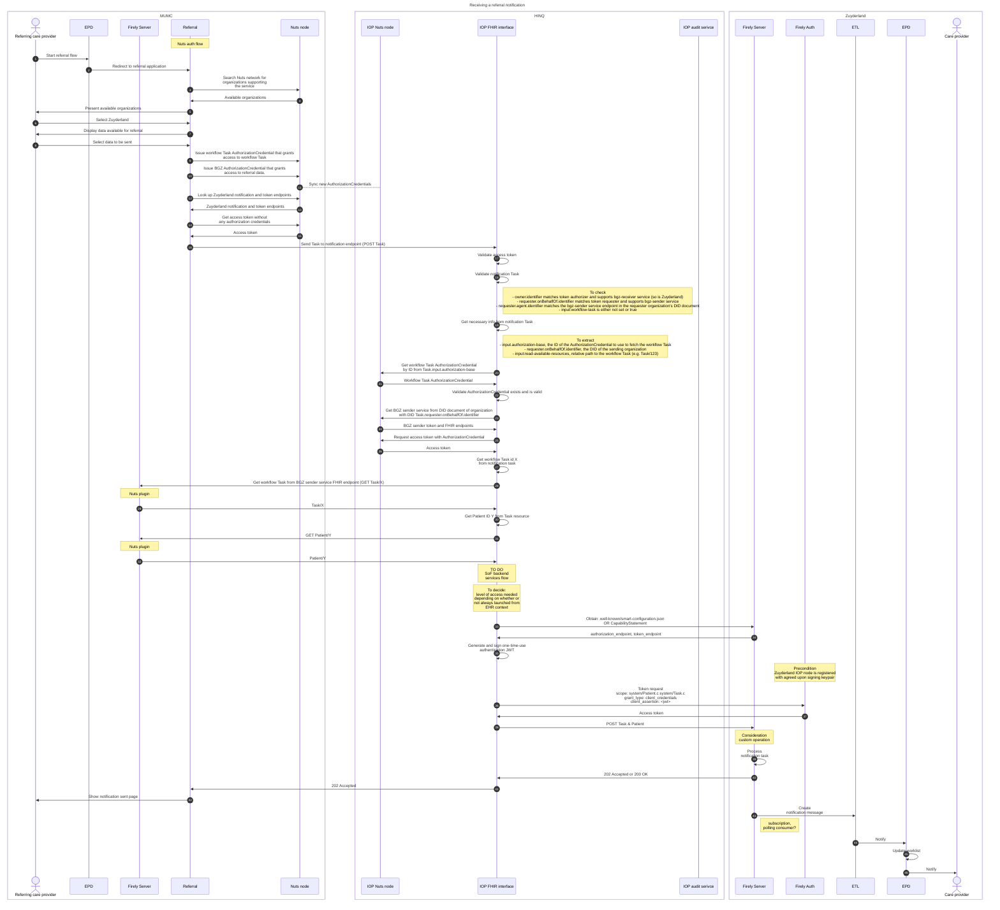

# Incoming referral notification

```mermaid
sequenceDiagram
    autonumber

    title Receiving a referral notification

    box MUMC
        actor mp as Referring care provider
        participant me as EPD
        participant mf as Firely Server
        participant mr as Referral
        participant mn as Nuts node
    end

    box HINQ
        participant hn as IOP Nuts node
        participant hf as IOP FHIR interface
        participant ha as IOP audit serivce
    end

    box Zuyderland
        participant zf as Firely Server
        participant za as Firely Auth
        participant zt as ETL
        participant ze as EPD
        actor zp as Care provider
    end

    note over mr: Nuts auth flow
    mp->>me: Start referral flow
    me->>mr: Redirect to referral application
    mr->>mn: Search Nuts network for<br/>organizations supporting<br/>the service
    mn->>mr: Available organizations
    mr->>mp: Present available organizations
    mp->>mr: Select Zuyderland
    mr->>mp: Display data available for referral
    mp->>mr: Select data to be sent
    mr->>mn: Issue workflow Task AuthorizationCredential that grants<br/>access to workflow Task
    mr->>mn: Issue BGZ AuthorizationCredential that grants<br/>access to referral data.
    mn-->hn: Sync new AuthorizationCredentials
    mr->>mn: Look up Zuyderland notification and token endpoints
    mn->>mr: Zuyderland notification and token endpoints
    mr->>mn: Get access token without<br/>any authorization credentials
    mn->>mr: Access token
    mr->>hf: Send Task to notification endpoint (POST Task)
    hf->>hf: Validate access token
    hf->>hf: Validate notification Task
    note right of hf: To check<br/>- owner.identifier matches token authorizer and supports bgz-receiver service (so is Zuyderland)<br/>- requester.onBehalfOf.identifier matches token requester and supports bgz-sender service<br/>- requester.agent.identifier matches the bgz-sender service endpoint in the requester organization's DID document<br/>- input:workflow-task is either not set or true
    hf->>hf: Get necessary info from notifcation Task
    note right of hf: To extract<br/>- input.authorization-base, the ID of the AuthorizationCredential to use to fetch the workflow Task<br/>- requester.onBehalfOf.identifier, the DID of the sending organization<br/>- input:read-available-resources, relative path to the workflow Task (e.g. Task/123)
    hf->>hn: Get workflow Task AuthorizationCredential<br/>by ID from Task.input.authorization-base
    hn->>hf: Workflow Task AuthorizationCredential
    hf->>hf: Validate AuthorizationCredential exists and is valid
    hf->>hn: Get BGZ sender service from DID document of organization<br/> with DID Task.requester.onBehalfOf.identifier
    hn->>hf: BGZ sender token and FHIR endpoints
    hf->>hn: Request access token with AuthorizationCredential
    hn->>hf: Access token
    hf->>hf: Get workflow Task id X<br/>from notification task
    hf->>mf: Get workflow Task from BGZ sender service FHIR endpoint (GET Task/X)
    note over mf: Nuts plugin
    mf->>hf: Task/X
    hf->>hf: Get Patient ID Y from Task resource
    hf->>mf: GET Patient/Y
    note over mf: Nuts plugin
    mf->>hf: Patient/Y
    note over hf:TO DO<br/>SoF backend<br/>services flow
    note over hf:To decide:<br/>level of access needed<br/>depending on whether or <br/>not always launched from <br/>EHR context
    hf->>zf : Obtain .well-known/smart-configuration.json<br/>OR CapabilityStatement
    zf->>hf: authorization_endpoint, token_endpoint
    hf->>hf: Generate and sign one-time-use<br/>authentication JWT
    note over za: Precondition<br/>Zuyderland IOP node is registered<br/>with agreed upon signing keypair
    hf->>za: Token request<br/>scope: system/Patient.c system/Task.c<br/>grant_type: client_credentials<br/>client_assertion: <jwt>
    za->>hf: Access token
    hf->>zf: POST Task & Patient
    note over zf:Consideration<br/>custom operation
    zf->>zf: Process<br/>notification task
    zf->>hf: 202 Accepted or 200 OK
    hf->>mr: 202 Accepted
    mr->>mp: Show notification sent page
    zf->>zt: Create<br/>notification message
    note right of zf: subscription,<br/>polling consumer?
    zt->>ze: Notify
    ze->>ze: Update worklist
    ze->>zp: Notify
```
