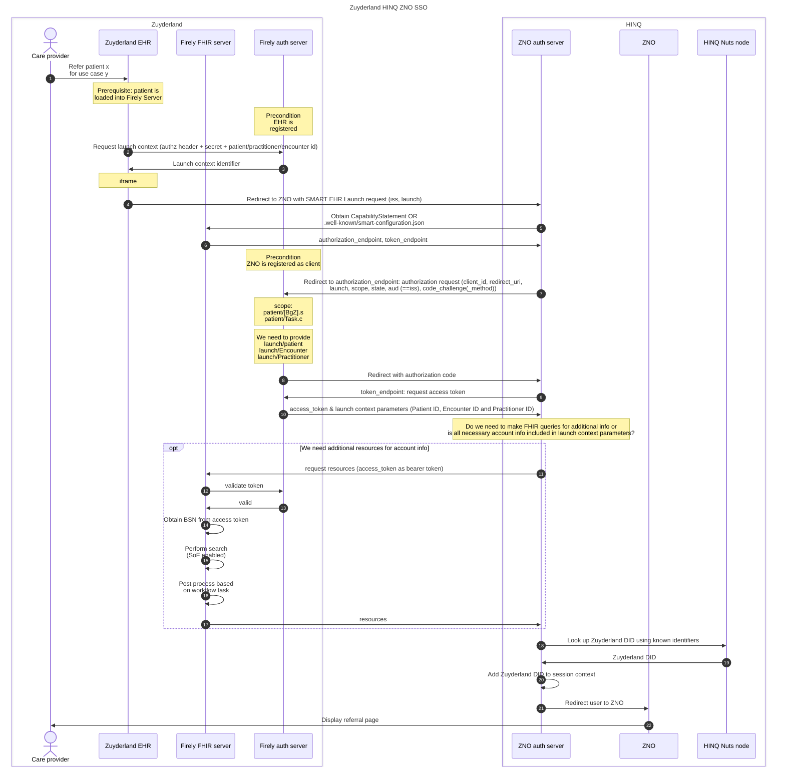

# SMART-on-FHIR based Zuyderland-HINQ SSO

```mermaid
sequenceDiagram
    autonumber

    title Zuyderland HINQ ZNO SSO

    box Zuyderland
        actor zp as Care provider
        participant ze as Zuyderland EHR
        participant zff as Firely FHIR server
        participant zfa as Firely auth server
    end

    box HINQ
        participant ha as ZNO auth server
        participant hz as ZNO
        participant hn as HINQ Nuts node
    end

    zp->>ze: Refer patient x<br/>for use case y
    note over ze: Prerequisite: patient is<br/>loaded into Firely Server
    note over zfa:Precondition<br/>EHR is<br/>registered
    ze->>zfa: Request launch context (authz header + secret + patient/practitioner/encounter id)
    zfa->>ze: Launch context identifier
    note over ze: iframe
    ze->>ha: Redirect to ZNO with SMART EHR Launch request (iss, launch)
    ha->>zff: Obtain CapabilityStatement OR<br/>.well-known/smart-configuration.json
    zff->>ha: authorization_endpoint, token_endpoint
    note over zfa:Precondition<br/>ZNO is registered as client
    ha->>zfa: Redirect to authorization_endpoint: authorization request (client_id, redirect_uri, <br/>launch, scope, state, aud (==iss), code_challenge(_method))
    note over zfa: scope:<br/>patient/[BgZ].s<br/>patient/Task.c
    note over zfa: We need to provide<br/>launch/patient<br/>launch/Encounter<br/>launch/Practitioner
    zfa->>ha: Redirect with authorization code
    ha->>zfa: token_endpoint: request access token
    zfa->>ha: access_token & launch context parameters (Patient ID, Encounter ID and Practitioner ID)
    note over ha: Do we need to make FHIR queries for additional info or<br/>is all necessary account info included in launch context parameters?
    opt We need additional resources for account info
    ha->>zff: request resources (access_token as bearer token)
    zff->>zfa: validate token
    zfa->>zff: valid
    zff->>zff: Obtain BSN from access token
    zff->>zff: Perform search<br/>(SoF enabled)
    zff->>zff: Post process based<br/>on workflow task
    zff->>ha: resources
    end
    ha->>hn: Look up Zuyderland DID using known identifiers
    hn->>ha: Zuyderland DID
    ha->>ha: Add Zuyderland DID to session context
    ha->>hz: Redirect user to ZNO
    hz->>zp: Display referral page
```
